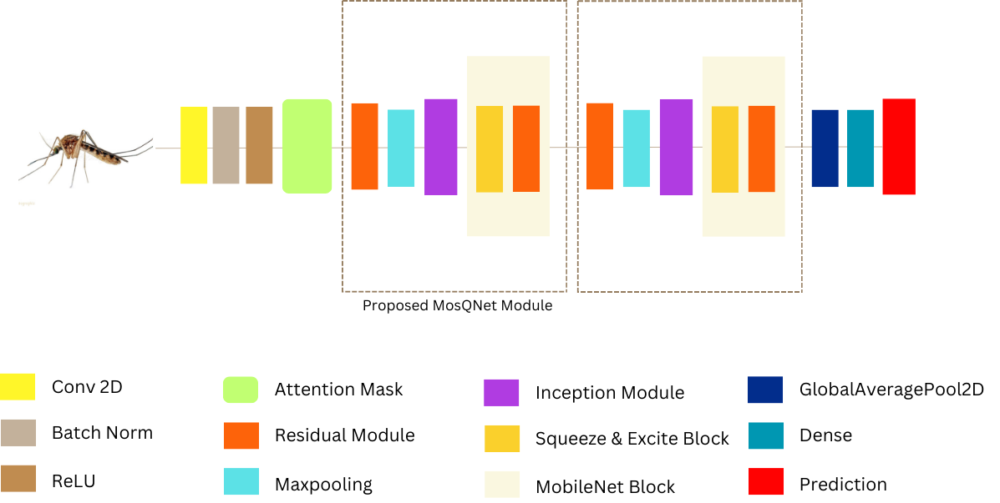
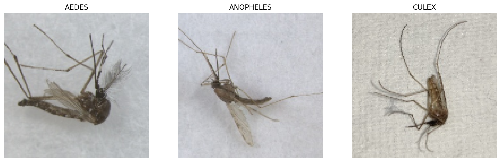
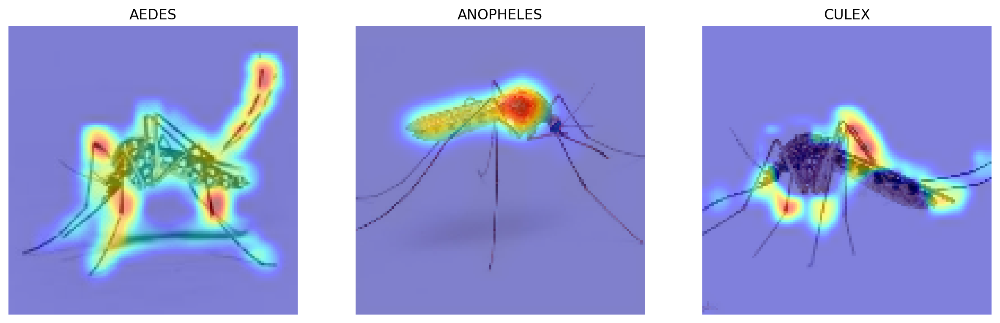

# MosQNet-SA: Advanced Mosquito Species Classification

## Overview

MosQNet-SA is a novel deep learning model designed for accurate classification of mosquito species. This project focuses on distinguishing between three primary mosquito species: Anopheles, Aedes, and Culex, which are significant vectors for various diseases.



## Dataset

The dataset comprises 3,000 meticulously selected and annotated mosquito images:

- Anopheles: 1,000 images
- Aedes: 1,000 images
- Culex: 1,000 images

Sources:
1. [Mosquito Alert](https://www.mosquitoalert.com/en/mosquito-images-dataset/)
2. [Mendeley Data](https://data.mendeley.com/datasets/88s6fvgg2p/4)
3. [IEEE DataPort](https://ieee-dataport.org/open-access/image-dataset-aedes-and-culex-mosquito-species)
4. [Dryad](https://datadryad.org/stash/dataset/doi:10.5061/dryad.z08kprr92)

The curated dataset used in this study is available on Kaggle:
[MosQNet-SA Dataset on Kaggle](https://www.kaggle.com/datasets/masud1901/mosquito-dataset-for-classification-cnn/data)

These are the sample mosquito images



## Methodology

### Transfer Learning Analysis

We conducted an extensive analysis of various pre-trained models:

- VGG16, VGG19
- ResNet50, ResNet101, ResNet152
- Xception
- InceptionV3, InceptionResNetV2
- MobileNet, MobileNetV2
- DenseNet121, DenseNet169, DenseNet201
- NASNetMobile
- EfficientNetB0, EfficientNetB1, EfficientNetB2

### MosQNet-SA Architecture

Our proposed model, MosQNet-SA, incorporates:

- Residual blocks
- Inception-like blocks
- MBConv blocks
- Spatial Attention mechanism


## Results

MosQNet-SA outperforms traditional transfer learning approaches:

| Model      | Test Accuracy | Params   | Trainable Params |
|------------|---------------|----------|------------------|
| MosQNet-SA | 99.42%        | 388,349  | 384,155 (98.92%) |

### Performance Metrics

| Metric    | Anopheles | Aedes    | Culex    |
|-----------|-----------|----------|----------|
| Accuracy  | 0.987752  | 0.998721 | 0.973467 |
| Precision | 0.993664  | 0.990643 | 0.979466 |
| Recall    | 0.980208  | 0.99882  | 0.985537 |
| F1-score  | 0.98689   | 0.994715 | 0.982492 |

## Data Augmentation

We employed various augmentation techniques:

- Width and Height Shift (10%)
- Shear and Zoom Transformations (10%)
- Horizontal Flipping
- Nearest Neighbor Filling

## Training Strategies

- Optimizer: Adam
- Learning Rate: 0.001
- Epochs: 81

### Callbacks

- EarlyStopping
- ModelCheckpoint
- TensorBoard
- ReduceLROnPlateau
- CSVLogger
- LearningRateScheduler

## Explainable AI (XAI)

We utilized multiple XAI techniques for model interpretation:

- Saliency
- GradientInput
- GuidedBackprop
- IntegratedGradients
- SmoothGrad
- SquareGrad
- VarGrad
- GradCAM
- Occlusion
- RISE
- SobolAttributionMethod
- LIME
- KernelShap



## Conclusion

MosQNet-SA demonstrates superior performance in mosquito species classification, achieving 99.42% accuracy with a significantly smaller model size compared to traditional transfer learning approaches.

## Future Work

- Expand the dataset to include more mosquito species
- Explore deployment on edge devices for real-time classification
- Investigate the model's performance in real-world scenarios

<!-- ## Citation -->

<!-- If you use this work in your research, please cite: -->
<!-- 
```
@article{YourName2024MosQNetSA,
  title={MosQNet-SA: Advanced Deep Learning for Mosquito Species Classification},
  author={Your Name},
  journal={arXiv preprint arXiv:XXXX.XXXXX},
  year={2024}
}
``` -->

## License

This project is licensed under the MIT License - see the [LICENSE](LICENSE) file for details.
