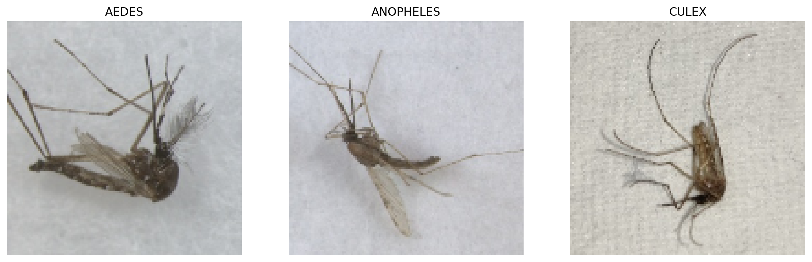
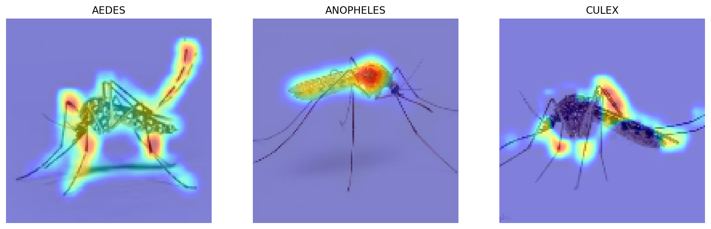

# MosQNet-SA: Advanced Mosquito Species Classification

## Overview

MosQNet-SA is a novel deep learning model designed for accurate classification of mosquito species. This project focuses on distinguishing between three primary mosquito species: Anopheles, Aedes, and Culex, which are significant vectors for various diseases.

## Repository Structure

```text
MosQNet-SA/
├── notebooks/
│   ├── baselines/         # Transfer learning baseline model notebooks
│   ├── mosqnet_sa/        # Main MosQNet-SA training notebook
│   ├── experiments/       # Architecture variant experiments
│   ├── evaluation/        # Evaluation notebooks (e.g., ROC analysis)
│   └── xai/               # Explainability notebooks
├── figures/               # Figures used in paper and README
├── MosQNet-SA/            # Model artifacts and additional project assets
├── XAI_on_MosQNetSA/      # XAI-related model artifact(s)
└── README.md
```

## Dataset

The dataset comprises 3,000 meticulously selected and annotated mosquito images:

- Anopheles: 1,000 images
- Aedes: 1,000 images
- Culex: 1,000 images

Sources:
1. [Mosquito Alert](https://www.mosquitoalert.com/en/mosquito-images-dataset/)
2. [Mendeley Data](https://data.mendeley.com/datasets/88s6fvgg2p/4)
3. [IEEE DataPort](https://ieee-dataport.org/open-access/image-dataset-aedes-and-culex-mosquito-species)
4. [Dryad](https://datadryad.org/stash/dataset/doi:10.5061/dryad.z08kprr92)

The curated dataset used in this study is available on Kaggle:
[MosQNet-SA Dataset on Kaggle](https://www.kaggle.com/datasets/masud1901/mosquito-dataset-for-classification-cnn/data)

These are the sample mosquito images



## Methodology

### Transfer Learning Analysis

We conducted an extensive analysis of various pre-trained models:

- VGG16, VGG19
- ResNet50, ResNet101, ResNet152
- Xception
- InceptionV3, InceptionResNetV2
- MobileNet, MobileNetV2
- DenseNet121, DenseNet169, DenseNet201
- NASNetMobile
- EfficientNetB0, EfficientNetB1, EfficientNetB2

### MosQNet-SA Architecture

Our proposed model, MosQNet-SA, incorporates:

- Residual blocks
- Inception-like blocks
- MBConv blocks
- Spatial Attention mechanism


## Results

MosQNet-SA outperforms traditional transfer learning approaches:

| Model      | Test Accuracy | Params   | Trainable Params |
|------------|---------------|----------|------------------|
| MosQNet-SA | 99.42%        | 388,349  | 384,155 (98.92%) |

### Performance Metrics

| Metric    | Anopheles | Aedes    | Culex    |
|-----------|-----------|----------|----------|
| Accuracy  | 0.987752  | 0.998721 | 0.973467 |
| Precision | 0.993664  | 0.990643 | 0.979466 |
| Recall    | 0.980208  | 0.99882  | 0.985537 |
| F1-score  | 0.98689   | 0.994715 | 0.982492 |

## Data Augmentation

We employed various augmentation techniques:

- Width and Height Shift (10%)
- Shear and Zoom Transformations (10%)
- Horizontal Flipping
- Nearest Neighbor Filling

## Training Strategies

- Optimizer: Adam
- Learning Rate: 0.001
- Epochs: 81

### Callbacks

- EarlyStopping
- ModelCheckpoint
- TensorBoard
- ReduceLROnPlateau
- CSVLogger
- LearningRateScheduler

## Explainable AI (XAI)

We utilized multiple XAI techniques for model interpretation:

- Saliency
- GradientInput
- GuidedBackprop
- IntegratedGradients
- SmoothGrad
- SquareGrad
- VarGrad
- GradCAM
- Occlusion
- RISE
- SobolAttributionMethod
- LIME
- KernelShap



## Conclusion

MosQNet-SA demonstrates superior performance in mosquito species classification, achieving 99.42% accuracy with a significantly smaller model size compared to traditional transfer learning approaches.

## Future Work

- Expand the dataset to include more mosquito species
- Explore deployment on edge devices for real-time classification
- Investigate the model's performance in real-world scenarios

## Citation

If you use this work in your research, please cite:

```bibtex
@article{10.1371/journal.pone.0344970,
    doi = {10.1371/journal.pone.0344970},
    author = {Masud, Md. Akmol AND Akter, Sanjida AND Sultana, Nadia AND Islam, Mohammad Shahidul AND Abu Yousuf, Mohammed AND Noori, Farzan M. AND Uddin, Md Zia},
    journal = {PLOS ONE},
    publisher = {Public Library of Science},
    title = {MosQNet-SA: Explainable convolutional-attention network for mosquito classification with application as a RESTful API for dengue and malaria risk mapping},
    year = {2026},
    month = {04},
    volume = {21},
    url = {https://doi.org/10.1371/journal.pone.0344970},
    pages = {1-30},
    abstract = {Mosquito-borne diseases represent a significant global health challenge. Over 700,000 people succumb to mosquito-borne diseases annually, highlighting the important need for accurate and efficient mosquito classification systems. Current approaches face limitations in accuracy, computational efficiency, and interpretability, creating a gap that artificial intelligence can help address. This paper presents MosQNet-SA, a novel convolutional-attention network designed for mosquito classification that addresses these limitations through architectural choices. The proposed model incorporates a spatial attention mechanism and depthwise separable convolutions to enhance feature extraction while maintaining computational efficiency—achieving comparable performance with 10-fold fewer parameters than existing approaches. MosQNet-SA achieves 99.42% accuracy on a dataset of 1,000 images across three mosquito species (Aedes, Anopheles, and Culex), demonstrating strong performance compared to existing CNN architectures. The model’s explainability is enhanced through multiple methods, including Saliency, GradCAM, LIME, and Kernel SHAP, providing valuable insights into the decision-making process for public health practitioners. Additionally, we present a RESTful API implementation for real-time mosquito classification and disease risk mapping, demonstrating the practical applicability of our approach in public health surveillance systems.},
    number = {4},
}
```

## License

This project is licensed under the MIT License - see the [LICENSE](LICENSE) file for details.
